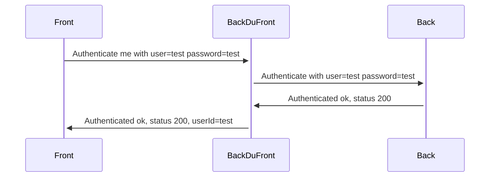

#### Membres équipe 1A
> CECCARELLI Luca  
> CLEMENT Romain  
> DESSAUD Hugo  
> LARBAOUI Riyad  
> RUBINI Thomas  

# Magasin Connecté
## Objectifs
Le projet que nous souhaitons réaliser concerne le développement d'une application mobile et d'un site web dédiés à l'IUT, centrés sur le Magasin Connecté

# Deploiement 
Créer et remplir les fichier `.env` respectivement dans les dossiers du `front` et du `back` (en suivant l'example donné dans `.env.example`. Puis utiliser `docker compose up -d`.

#  Schémas variées 
Fonctionnement du login:

